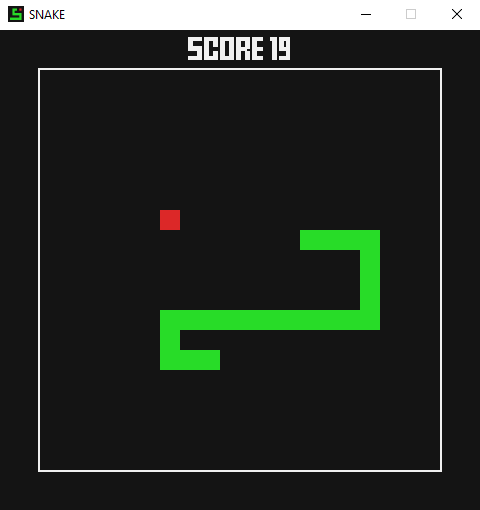

# Snake
Simple game created with Python3 and pygame module
> Before launching the game install font from `resources` folder
### How to play
- Use W, S, A, D, keys to move snake
- Eat red apples to grow snake
- Avoid boundaries and snake's tail
- If game is over press SPACE key to retry or ESCAPE to quit the game

### Preview of the game

